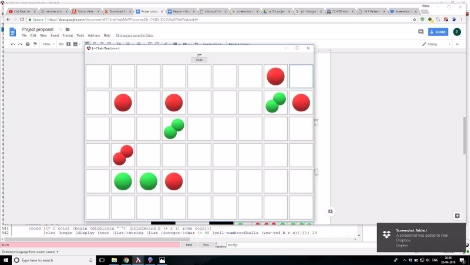
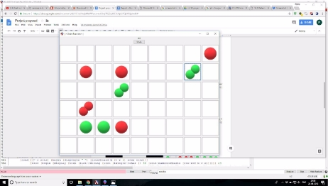
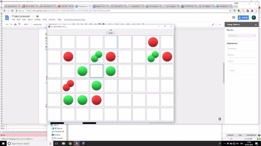
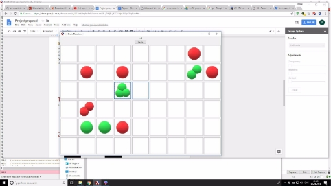
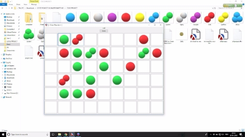
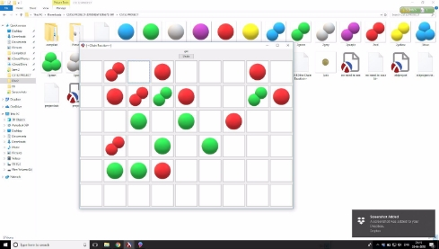

# Chain-Reaction
**CS 152: ABSTRACTIONS AND PARADIGMS PROJECT**

**CHAIN REACTION**

**Team Details:**

- Sumit  170050111
- Pushpendra Jakhar 170050049
- Debabrata Mandal  170050073

**Project Overview**

In this project we have developed the game “Chain Reaction” in racket.

**Description of the game**

Chain Reaction is a [combinatorial game](https://brilliant.org/wiki/combinatorial-games-definition/) for 2 - 8 players (can also be played against cpu). We shall be designing a single player and a multiplayer version of it using Drracket, allowing upto 6 players to play in a game.  

Rules of the game:

1. The gameplay takes place in an m\*n( 9\*6) board.All cells are initially empty. 
1. The Red and the Green player take turns to place "orbs" of their corresponding colors.  
1. The Red player can only place an red orb in an empty cell or a cell which already contains one or more red orbs. When two or more orbs are placed in the same cell, they stack up. 
1. When a cell is loaded with a number of orbs equal to its critical mass, the stack immediately explodes. As a result of the explosion, to each of the orthogonally adjacent cells, an orb is 

added and the initial cell loses as many orbs as its critical mass. The explosions might result in overloading of an adjacent cell and the chain reaction of explosion continues until every cell is stable. ***(Critical mass of corner cell- 2,Critical mass of boundary cell and not corner cell-3 , Critical mass of Non boundary cell- 4).***

5. When a red cell explodes and there are green cells around, the green cells are converted to red. 

**Discussion on Game**

The most interesting thing is how unpredictable the game seems to be in the end, at least when you play it with your human friends. The obvious heuristic that tells us you're better off at the moment by having as many orbs as possible turns out to be very wrong. While it so seems to everyone, that say, red will win, blue suddenly takes over. 

**Sample Input Output**:

**Input**- User can add a orb in a cell of the board by clicking**  anywhere in the board.On clicking, the

board is updated and the turn is switched.The menus would contain buttons which can be accessed using mouse clicks.

**Output**-Computer will show the **updated Grid** according to the rules as mentioned above  . The cpu takes in the state of the game and returns the most profitable position in single player game.

1. Situation at some point of time (now, as the player “red”  taps on the  upper rightmost corner cell  situation becomes this )

2.​ Situation at some point of time                              (now ,as the player “green” taps on the cell containing 3

green balls situation becomes this)

3. Situation at some point of time              (now ,as the player “red” taps on the topmost cell containing 2 red balls situation becomes this)

**Implementation**

We have used a 2-d vector to maintain the information regarding each cell in the grid. The critical masses (i.e. when the cell would burst) for the cells are as defined earlier.  

We have made use of the **gui(racket/gui)** feature available in racket to implement the interface and 

The cells in the board have been implemented using structure.We have done abstractions by creating a single function to create  different instances of some functions of similar kind. 

The game can be played in both multiplayer mode and single player against the computer. In multiplayer upto 6 players can play in a game. 

**Graphics** **:** 

To make “cells” we have used buttons (belonging to “my-button%” class which is linked to a struct named “cel” which contains : ‘numberofballs’,’color’,’criticalmass’,and coordinates.) which are labelled with pictures accordingly to the board. 

We have used the **MINI-MAX Algorithm** to calculate the best possible move and again update the board. We will also make GUI functions which display the board after each move using this list . 

**Single Player Mode:** 

The Single Player Mode is based on the famous algorithm Mini-Max . This Alggorithm is based on the concept of general trees. What it does is it takes a particular state of the board at any call any plays on the board any N number of times as given as input . Now on the basis of the boards that originated on this playing of the algo , we obtain a list of possible moves for the AI that would result in the winning of the code. But wait that’s NOT IT . As we said the AI can play on the board any number of times it wishes to (obviously the time taken for such computation would be extremely large). 

**Using Mini-Max in Chain Reaction:-** 

We have kept the logic simple because of the fact that chain reaction is a Probabilistic Game (in layman terms can change its favour to any of the opponents). So making the tree go upto **TWO** levels of depth is a sufficient necessity for it to have an upper hand over human players. We have used **Functional Programming** for this part mainly and have made use of **States in Imperative Programming**  as a tool to make use of 2d-vectors in the program. 

**Limitations and Bugs**

1. We have made an undo command that should be used only once .
1. We have not implemented difficulty levels when playing against the computer . We have made it of a certain difficulty level.
1. We have tested our code over as many situations as possible in the time given to us . Still there might be some very rare cases which we might have overlooked. In 5 player mode , in a particular pattern the frame hangs.

**Features**

1. The game engine is developed for a m\*n board . Graphics is developed for a 6\*9 board.
1. Single-player mode and 2-6 player modes are available.
1. New -game feature and undo command is available for the convenience of the player.
